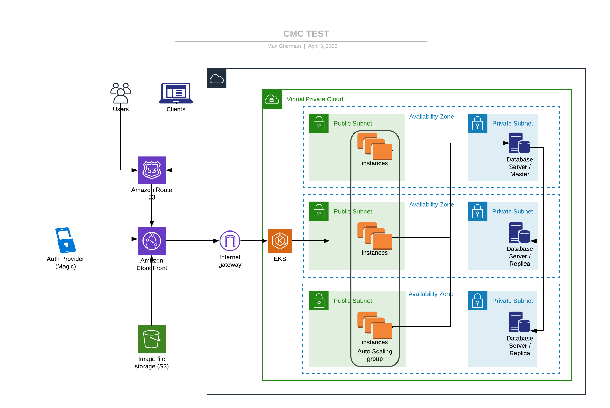

# cmc test

## NodeJs REST APIs / React SPA for e-commerce business

## Server

The project represents a collection of REST APIs for e-commence business management. APIs provide the ability retrieve a list of products, add a product to a cart, remove a product form cart and checkout:

* User login - /api/login
* User logout - /api/logout
* Retrieve product list - /api/products
* Retrieve cart contents - /api/carts/:id
* Add product to cart - /api/carts/:id/items
* Create cart and add a product to it - /api/carts/items
* Set cart currency - /api/carts/:id/currency
* Remove product form cart - /api/carts/:cartId/items/:id
* Checkout - /api/carts/:id/checkout

### Technical stack

* REST API implementation language - [TypeScript](https://www.typescriptlang.org/)
* HTTP Server - [NodeJs](https://nodejs.org/)
* API Framework - [ExpressJs](https://expressjs.com/)
* Auth Provider - [Magic](https://magic.link/)
* Infrastructure implementation language - [CloudFormation](https://aws.amazon.com/cloudformation/)
* Server life-cycle management - [ASW AKS](https://aws.amazon.com/eks/)

### Design decisions

- [x] API architecture - [REST](https://en.wikipedia.org/wiki/Representational_state_transfer)
- [x] Application design
    - API interface - [Model-View-Controller](https://en.wikipedia.org/wiki/Model%E2%80%93view%E2%80%93controller)
    - Business logic - simplified Layered Architecture
        - [Service layer pattern](https://en.wikipedia.org/wiki/Service_layer_pattern)
- [x] Authentication
    - Password-less provider based one decentralized tokens
        - [Magic](https://magic.link/)
        - [Tokens](https://docs.magic.link/decentralized-id)
- [x] Metadata persistence
    - Static in-memory data for test purposes

 
### APIs

* User login

```
 * @route POST /api/login
 * @param {string} Authorization Bearer herder - token text
 * @returns {} 200 - user logged in
 * @returns {} 401 - authentication failed
```

* User logout

```
 * @route POST /api/logout
 * @param {string} Authorization Bearer herder - token text
 * @returns {} 200 - user logged out
 * @returns {} 422 - logout failed
```

* Retrieve product list

```
 * @route GET /api/products/
 * @returns {} 200 - product list
 * @returns {Error}  default - Unexpected error
```

* Retrieve cart contents

```
 * @route GET /api/carts/:id
 * @param {string} id.query.required - cart id
 * @returns {Cart} 200 - cart found
 * @returns {} 404 - cart not found
 * @returns {Error}  default - Unexpected error
```

* Create cart and add a product to it

```
 * @route POST /api/carts/items
 * @param {Product} product.body.required - { productId, quantity }
 * @returns {Cart} 200 - cart found
 * @returns {} 404 - cart not found
 * @returns {Error}  default - Unexpected error
```

* Add product to cart

```
 * @route POST /api/carts/:id/items
 * @param {string} id.query.required - cart id
 * @param {Product} product.body.required - { productId, quantity }
 * @returns {Cart} 200 - cart found
 * @returns {} 404 - cart not found
 * @returns {Error}  default - Unexpected error
```

* Set cart currency

```
 * @route POST /api/carts/:id/currency
 * @param {string} id.query.required - cart id
 * @returns {Cart} 200 - cart found
 * @returns {} 404 - cart not found
 * @returns {Error}  default - Unexpected error
```

* Remove product form cart

```
 * @route DELETE /api/carts/:cartId/items/:id
 * @param {string} cartId.query.required - cart id
 * @param {string} id.query.required - productId id
 * @returns {Cart} 200 - cart found
 * @returns {} 404 - cart not found
 * @returns {Error}  default - Unexpected error
```

* Checkout - /api/carts/:id/checkout

```
 * @route POST /api/carts/:id/checkout
 * @param {string} Id.query.required - cart id
 * @returns {} 200 - success
 * @returns {} 401 - user not authenticated
 * @returns {} 422 - checkout failed
 * @returns {Error}  default - Unexpected error
```

### Source files outline

* server - server related implementations
    - app - application implementation content
        - build - deploy-able artifacts  artifacts
        - src - source files
            - routes - API controllers base
            - cart - cart functionality related controller/services
            - products - products functionality related controller/services
            - users - user functionality related controller
            - finance - financial services
            - utils - cross cutting concerns implementation
                - middleware - express middleware
                    - error logging
                    - global error handling
                    - user authentication
                - logger - logging facility
                - config - global config
            - `app.ts` - main application file
            - `index.ts` - application entry point  
        - Dockerfile - docker image build file          
    - infra - infrastructure as code content
        - eks - AKS provisioning artifacts
            - aws-auth-cm.yaml - EC2 nodes provisioning script
            - eks-cluster.yaml - cluster
            - eks-cluster-network.yaml - cluster network group
            - eks-nodegroup.yaml - cluster node group
            - k8s.yaml - application container deployment script
        - user - user provisioning artifacts
            - user.yaml - creates user to be used for future infrastructure provisioning

### Local development

- Register application with [Magic](https://magic.link/) provider using preferred email address 
- Navigate to `app` folder
- Create `.env` with the contents from .env.example file. Setup values for all variables
- Install application dependencies, run:

```sh
npm i
npm run dev
```

### Production deployment

- Create separate AWS user using CloudFormation template provided
- Create k8s infrastructure sing CloudFormation templates provided
    1.  Cluster network
    2.  Cluster
    3.  Node group
    4.  Authorize nodes against cluster (substitute cluster role and user arn)
- Setup CI/CD pipeline
    1.  Build docker image using Dockerfile provided (set up all environment variables)
    2.  Push docker image to the private registry
    3.  Update k8s.yam file with the image registry path
    4.  Apply k8s.yam deployment
    5.  Setup DNS resolver (for example Route 53) to route traffic into the cluster (template not provided)

Note: Kubernetes network architecture provided consist of the public subnets only. This approach works well for production ready demonstrations. For more secure environments, network architecture has to be altered so nodes could be be placed into private subnets while traffic is routed via a NAT Gateways from public subnets. 

### Infrastructure


 

## Client

The project represents a React SPA with views corresponding server REST APIs: products, cart, checkout

### Technical stack

* REST API implementation language - [TypeScript](https://www.typescriptlang.org/)
* Frontend framework - [ReactJS](https://reactjs.org/)
* Router - [React router](https://reactrouter.com/) 
* Auth Provider - [Magic](https://magic.link/)
* Infrastructure implementation language - [CDK](https://aws.amazon.com/cdk/)
* Client life-cycle management - [ASW S3](https://aws.amazon.com/s3/)

### Design decisions

- [x] Authentication
    - Password-less provider based one decentralized tokens
        - [Magic](https://magic.link/)
        - [Tokens](https://docs.magic.link/decentralized-id)
- [x] State management
    - [Rect context](https://reactjs.org/docs/context.html)

### Source files outline

* client - server related implementations
    - app - application implementation content
        - dist - deploy-able artifacts  artifacts
        - src - source files
            - app - main application component
            - `index.ts` - main application entry point
            - back-end - REST/server communication module
            - components - shared components
            - context - shared contexts
            - pages - views
    - infra - infrastructure as code content
        - cdk.json - CDK meta information file
        - static-website-stack.ts - static web site stack
        - static-website-app.ts - static web site application

### Local development

- Register application with [Magic](https://magic.link/) provider using preferred email address 
- Navigate to `app` folder
- Create `.env` with the contents from .env.example file. Setup values for all variables
- Start the server, if not running
- Install application dependencies, run:

```sh
npm i
npm run dev
```
